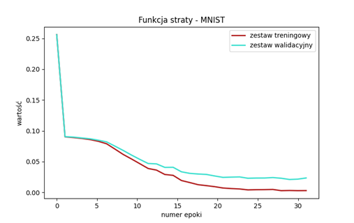
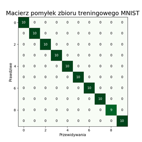
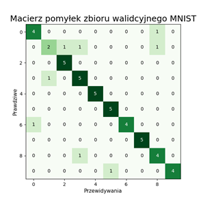
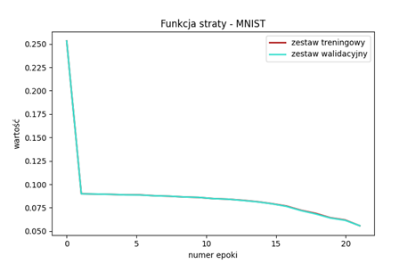
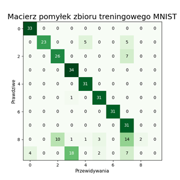
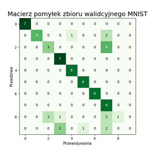

# Perceptron wielowarstwowy
***Wykonawcy - Sofiia Levchenko [sofiia2002](https://github.com/sofiia2002), Małgorzata Sikora [Maugosia](https://github.com/Maugosia)***
## Wstęp
Tematem projektu jest implementacja od zera perceptronu wielowarstwowego o wybranym
algorytmie optymalizacji gradientowej z algorytmem propagacji wstecznej i przetestowanie jego
działania na ogólnodostępnym zbiorze danych MNIST.
Zadanie zrealizowano w sposób ogólny tak, aby sieć dało się testować również na innych
zbiorach danych.
## Struktura projektu  
Ze względu na specyfikę wykonywanego zadania, zdecydowałyśmy się, że struktura projektu
będzie wyglądała w następujący sposób:
* main.py - zawiera wywołania eksperymentów przeprowadzonych w trakcie realizacji
zadania
* experiments.py - funkcje z definicjami eksperymentów przeprowadzonych w trakcie
zadania
* multilayer_perceptron.py - implementacja wielowarstwowego perceptronu (naszej sieci
neuronowej) w postaci klasy MultilayerPerceptron.
* neuron.py - implementacja pojedynczego węzła warst ukrytych oraz warstwy wyjściowej
sieci neuronowej w postaci klasy Neuron.
* sgd.py - implementacja funkcji pomocniczych, wykorzystywanych do obliczania
gradientu na potrzeby zmiany wag węzłów sieci neuronowej.
* activation_funcions.py - reprezentacja używanych funkcji aktywacji przy pomocy
biblioteki sympy (zostały zaimplementowane takie funkcje jak tnh, sigmoid oraz ReLU).
* get_data.py - funckje pomocnicze, wykorzystywane w celu załadowania oraz
przetworzenia (normalizacji wartości oraz oddzielenia od zbioru danych nagłówka z
nazwami kolumn) zbioru danych, na których następnie trenowaliśmy oraz sprawdzaliśmy
sieć neuronową.
* plot_data.py - funkcije pomocnicze pozwalające na stworzenie wykresów - krzywej
uczenia oraz macierzy pomyłek 
\
&nbsp; 
\
&nbsp;
W ramach projektu były wykorzystywane różne biblioteki zewnętrzne, ułatwiające wykonanie
zadania: 
\
&nbsp;
* numpy, math - do działań na różnych strukturach danych oraz przeprowadzenia na nich
obliczeń/działań matematycznych.
* sympy - do przedstawienia w czytelny sposób funkcji aktywacji oraz obliczanie ich gradientu
* random - do generowania liczb losowych na podstawie których wybierane są próbki do
uczenia sieci neuronowej
* sklearn, pandas - do przetwarzania/załadowania zbiorów danych
* mlextend - biblioteka zawierająca narzędzie pozwalające w łatwy sposób automatycznie
generować ilustrację macierz pomyłek.
* matplotlib - biblioteka ułatwiająca tworzenie wykresów
## Decyzje projektowe

Główna część implementacji problemu zawarta jest w dwóch klasach - Neuron oraz
MultilayerPerceptron.
\
&nbsp; 
***Klasa Neuron*** stanowi reprezentację pojedynczej jednostki sieci przetwarzającej informację, jego
główne atrybuty to:
* używana funkcja aktywacji
* wagi wejściowe (losowane podczas inicjalizacji z rozkładu jednostajnego)
* wartość bias
\
&nbsp; 
\
&nbsp; 
Również zostały wprowadzone dodatkowe atrybuty na potrzeby przeprowadzenia propagacji
wstecznej:
* wartość wyjścia (po przejściu przez funkcję aktywacji)
* wartość wyjścia (przez przejściem przez funkcję aktywacji)

\
&nbsp; 
Wspomniana klasa Neuron również posiada również kilka metod (oprócz funkcji do
inicjalizacji bias’u oraz wag), pozwalających na zmianę wartości wag oraz bias’u podczas
przeprowadzenia propagacji wstecz. Do tych funkcji wprowadzany są obliczony gradient oraz wartość
kroku (parametr beta), na podstawie których obliczane są nowe wartości wag oraz bias’u.
\
&nbsp;
\
&nbsp;
***Klasa MultilayerPerceptron*** stanowi reprezentację całej sieci. Zawiera metody pozwalające
na inicjalizację sieci, trenowanie sieci, czy uzyskiwanie przewidywań na podstawie próbki danych
wejściowych. Dana klasa pozwala na stworzenia sieci neuronowej o dowolnej liczbie wejść, wyjść,
warstw ukrytych oraz liczbie węzłów w środku takiej warstwy ukrytej.
Najważniejsze z punktu widzenia działania programu atrybut tej klasy to:
* network - lista list reprezentująca sieć neuronową. Każdy jej wiersz odpowiada jednej
warstwie. Elementy warstwy stanowią obiekty klasy Neuron, przykładowo dla 3 warstw i 2
neuronów w każdej warstwie:\
&nbsp;
[[neuron_11, neuron_12], [neuron_21, neuron_22], [neuron_31, neuron_32]]
\
&nbsp;
Funkcja inicjalizująca pozwala wybrać dowolną liczbę warstw i ustawić różną liczbę
neuronów na każdej z nich (poza ostatnią, w której liczba neuronów jest automatycznie
dostosowywana do wymiaru wyjścia z sieci). Można też każdej warstwie ustawić inną funkcję
aktywacji (identyczną dla wszystkich neuronów w tej warstwie).\
&nbsp;
Trenowanie sieci, reprezentowanej za pomocą klasy MultilayerPerceptron odbywa się na
zasadzie propagacji wstecznej, gdzie najpierw jest obliczana pomyłka dla warstw wyjściowych, a
następnie na jej podstawie jest obliczana odchyłka dla każdej z wag oraz biasów (którą uśredniamy
dla N próbek z paczki) dla każdej kolejnej warstwy (od ostatniej do pierwszej) na zasadzie reakcji
łańcuchowej

## Opis wykonanych eksperymentów

Ponieważ na chwilę obecną nie istnieją metody automatycznej generacji hiperparametrów
sieci neuronowej dla wszystkich możliwych zadań (typu regresji czy klasyfikacji) i wszystkich
możliwych danych, konfiguracja odbyła się metodą prób i błędów.\
&nbsp;
Zaczęłyśmy od testowania naszej sieci dla funkcji prostszych, wymagających prostszych
konfiguracji sieci neuronowej (funkcji OR oraz AND), następnie dla bardziej skomplikowanego
zbioru danych, gdzie sieć miałaby kilka wejść i jedno wyjście (klasyfikator zero-jedynkowy
wykorzystywany do predykcji czy jakieś mieszkanie o określonych cechach ma cenę wyższą od
średniej, czy jednak nie), na koniec ukształtowałyśmy naszą sieć w taki sposób aby mogła
przetworzyć i przewidywać wartości dla docelowego zbioru MNIST.\
&nbsp;
\
&nbsp;
Dla pierwszego typu eksperymentów, po przeprowadzeniu kilku prób, najlepszym zestawem
parametrów był:
* Ustawienie 1 warstwy ukrytej o 3 węzłach
* Wykorzystanie funkcji aktywacji tanh dla warstwy ukrytej oraz logistic dla warstwy
wyjściowej
* Wykorzystanie parametru beta równego 0.9
 \
&nbsp;
\
&nbsp;
Dla drugiego typu eksperymentów, po przeprowadzeniu kilku prób, najlepszym zestawem
parametrów był:
* Wykorzystanie 2 warstw ukrytych o 32 węzłach
* Wykorzystanie funkcji aktywacji tanh dla pierwszej warstwy ukrytej, ReLU dla drugie
warstwy ukrytej oraz logistic dla warstwy wyjściowej
* Wykorzystanie parametru beta równego 0.4\
&nbsp;
\
&nbsp;
Dla trzeciego i ostatniego eksperymentu, po przeprowadzeniu kilku prób, najlepszym
zestawem parametrów był:
* Wykorzystanie 2 warstw ukrytych o 192 węzłach
* Wykorzystanie funkcji aktywacji tanh dla pierwszej warstwy ukrytej, ReLU dla drugiej
warstwy ukrytej oraz logistic dla warstwy wyjściowej
* Wykorzystanie parametru beta równego 0.4

## Wyniki dla zbioru MNIST - pierwszy eksperyment

Pierwszy eksperyment stanowił wstępne badanie mające na celu określenie, czy wybrane wstępnie parametry mają szansę dać dobre wyniki na docelowym zbiorze MNIST po 30 epokach. 

Z tego powodu w eksperymencie tym posłużono się bardzo ograniczoną próbką danych podzieloną na dwie części - zbiór treningowy o liczebności 99 próbek oraz zbiór walidacyjny o liczebności równej 51. Mały rozmiar zbioru pozwolił szybko uzyskać wstępne wyniki działania sieci. 

Hiperparametry dla tego treningu wynosiły: 

*	3 warstwy
*	funkcje aktywacji dla każdej to: [TANH, RELU, LOGISTIC]
*	liczebność każdej z warstw to: [192, 192, 10]

*	30 epok
*	40 batchy trenujących
*	wartość beta uwzględniania poprawki równa 0,4

Jak widać, dla tak małego zbioru sieć nauczyła się go bez problemu. Nawet wyniki na zbiorze walidacyjnym są niezłe, chociaż pod koniec treningu wartość funkcji straty dla niego zmniejsza się wolniej. Z tego powodu kolejny eksperyment, dla większej próbki, przeprowadzono zmieniając ustawienia tylko nieznacznie

## Wyniki dla zbioru MNIST - drugi eksperyment

Tym razem przeprowadzony został docelowy eksperyment na dużej próbce danych. Ze względu na bardzo długi czas obliczeń dla tej liczby neuronów, nie wykorzystano całego zbioru MNIST, a jedynie 400 próbek z niego pochodzących. Przy podziale upewniono się, że wybrany podzbiór zawiera równomierny rozkład wszystkich klas. Najmniej liczna klasa w tym zbiorze stanowiła 9,75 %, natomiast najbardziej liczna: 10,50%, co oznacza że był on zrównoważony.
Zestaw był podzielony na trzy zbiory: Treningowy o liczebności 320, walidacyjny o liczebności 64 oraz testowy o liczebności 80.

Hiperparametry dla tego treningu wynosiły: 

*	3 warstwy
*	funkcje aktywacji dla każdej z nich to: [TANH, RELU, LOGISTIC]
*	liczebność każdej z warstw to: [128, 128, 10]

*	20 epok
*	40 batchy trenujących
*	wartość beta uwzględniania poprawki równa 0,4

Z wykresu przedstawiającego krzywą uczenia wynika, że proces uczenia się sieci przebiegał prawidłowo i nie ulegała ona przeuczeniu ani niedouczeniu. 
Macierze pomyłek przybliżają charakter błędów popełnianych przez klasyfikator. Jak widać ma on problem z rozpoznawaniem dwóch klas. Być może wynika to ze zbyt krótkiego czasu uczenia bądź zbyt małej liczby neuronów. 
Pozostałe klasy perceptron rozpoznaje bez problemu, co zostało potwierdzone na zbiorze testowym (ostatnia macierz). 

## Wnioski

Stworzona implementacja pozwala w elastyczny sposób inicjalizować sieci o różnej liczbie warstw, neuronów, różnych funkcjach aktywacji i parametrach uczenia. Dzięki temu można ją wykorzystywać dla zbiorów danych o różnej liczebności, stopniu skomplikowania, wymiarze danych wejściowych oraz różnej liczbie klas. 
\
&nbsp;\
&nbsp;
Po przeprowadzeniu wielu eksperymentów, mając na celu znaleźć odpowiednie parametry, dla których sieć będzie w stanie nauczyć się konkretnemu zbiorowi danych, zauważyliśmy kilka zależności między tymi parametrami i ich wpływem na jakość wytworzonej sieci:
*	Dla mniejszych zbiorów danych treningowych nie jest efektywnym wykorzystywanie małych beta (wyjątkiem są sytuacje kiedy mamy proporcjonalnie większą liczbę epok) - wartości prawdopodobieństw dla różnych klas (w przypadku klasyfikatora) wtedy trzymają się na podobnym poziomie i widać tylko niewielkie odchyłki od tych wartości
*	Również, dla małych zbiorów danych treningowych, istotną rolę gra liczebność batch’a - im mniejszy wtedy jest batch, tym jest to lepsze dla małych zbiorów danych, w przeciwnym przypadku uzyskujemy wynik uśredniony, nie odzwierciedlający rzeczywistość 
*	Nie zawsze wykorzystanie większej liczby warstw oznacza lepsze działanie sieci - czasami mniejsza liczba warstw z większą liczbą węzłów daje o wiele lepsze wyniki
*	Wybór właściwej funkcji aktywacji dla każdej z warstw jest bardzo ważnym czynnikiem, mającym wpływ na działanie całej sieci (wykorzystanie niepasującej  do problemu funkcji aktywacji w jednej z warstw może skutkować wielorazowym obniżeniem jakości przewidywanych wyników już nauczonej sieci)\
&nbsp;\
&nbsp;

Głównym problemem napotkanym podczas realizacji zadania był wyjątkowo długi czas obliczeń podczas treningu sieci. Częściowo wynika on z wyboru dużej liczby neuronów w każdej warstw a co za tym idzie - dużej liczby wag do aktualizacji w każdym kroku. (rzędu parunastu tysięcy dla warstwy).
\
&nbsp;
 	Z pewnością implementacja, mogłaby być wydajniejsza, wymagało by to kompletnej refaktoryzacji kodu oraz przemyślenia używanych w implementacji struktur danych.
